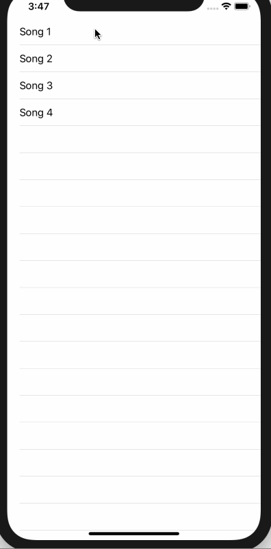

# AMMusicPlayerController

AMMusicPlayerController is an UI Controller with Apple Music-ish Player.

## Runtime Requirements

- iOS 10.0 or later

## Installation

### Carthage

```
github "yoheimuta/AMMusicPlayerController"
```

## Usage

For details, refer to the [Demo project](https://github.com/yoheimuta/AMMusicPlayerController/tree/master/Demo).

### Demo



```swift
import AMMusicPlayerController
import UIKit

class ViewController: UIViewController {

    let urls = [
        "https://storage.googleapis.com/maison-great-dev/oss/musicplayer/tagmp3_1473200_1.mp3",
        "https://storage.googleapis.com/maison-great-dev/oss/musicplayer/tagmp3_2160166.mp3",
        "https://storage.googleapis.com/maison-great-dev/oss/musicplayer/tagmp3_4690995.mp3",
        "https://storage.googleapis.com/maison-great-dev/oss/musicplayer/tagmp3_9179181.mp3",
    ].map { URL(string: $0)! }
    ...
    func presentModalViewController(index: Int) {
        let modal = AMMusicPlayerController.make(urls: urls,
                                                 index: index)
        modal.delegate = self
        modal.presentPlayer(src: self)
    }
}

```

### Customize

You can pass AMMusicPlayerConfig in order to customize all texts and images.

```swift
public struct AMMusicPlayerConfig {
    let lyricsLabel: String
    let confirmConfig: ConfirmConfig
    let controlConfig: ControlConfig

    public struct ConfirmConfig {
        let needConfirm: Bool
        let title: String
        let message: String
        let confirmActionTitle: String
        let cancelActionTitle: String

        public init(needConfirm: Bool = false,
                    title: String = "Need dismiss?",
                    message: String = "",
                    confirmActionTitle: String = "Confirm",
                    cancelActionTitle: String = "Cancel") {
            self.needConfirm = needConfirm
            self.title = title
            self.message = message
            self.confirmActionTitle = confirmActionTitle
            self.cancelActionTitle = cancelActionTitle
        }

        /// default is a default configuration.
        public static let `default` = ConfirmConfig()
    }

    public struct ControlConfig {
        let playButtonImage: UIImage
        let pauseButtonImage: UIImage
        let nextButtonImage: UIImage?
        let prevButtonImage: UIImage?
        let shuffleOffImage: UIImage
        let shuffleOnImage: UIImage
        let repeatNoneImage: UIImage
        let repeatOneImage: UIImage
        let repeatAllImage: UIImage
        let volumeMinImage: UIImage
        let volumeMaxImage: UIImage

        public init(playButtonImage: UIImage = fi("play_btn"),
                    pauseButtonImage: UIImage = fi("stop_btn"),
                    nextButtonImage: UIImage? = nil,
                    prevButtonImage: UIImage? = nil,
                    shuffleOffImage: UIImage = fi("icn_shuffle_off"),
                    shuffleOnImage: UIImage = fi("icn_shuffle_on"),
                    repeatNoneImage: UIImage = fi("icn_repeat_off"),
                    repeatOneImage: UIImage = fi("icn_single_repeat_on"),
                    repeatAllImage: UIImage = fi("icn_repeat_on"),
                    volumeMinImage: UIImage = fi("icn_volume_min"),
                    volumeMaxImage: UIImage = fi("icn_volume_on")) {
            self.playButtonImage = playButtonImage
            self.pauseButtonImage = pauseButtonImage
            self.nextButtonImage = nextButtonImage
            self.prevButtonImage = prevButtonImage
            self.shuffleOffImage = shuffleOffImage
            self.shuffleOnImage = shuffleOnImage
            self.repeatNoneImage = repeatNoneImage
            self.repeatOneImage = repeatOneImage
            self.repeatAllImage = repeatAllImage
            self.volumeMinImage = volumeMinImage
            self.volumeMaxImage = volumeMaxImage
        }

        /// default is a default configuration.
        public static let `default` = ControlConfig()
    }

    public init(lyricsLabel: String = "Lyrics",
                confirmConfig: ConfirmConfig = ConfirmConfig.default,
                controlConfig: ControlConfig = ControlConfig.default) {
        self.lyricsLabel = lyricsLabel
        self.confirmConfig = confirmConfig
        self.controlConfig = controlConfig
    }

    /// default is a default configuration.
    public static let `default` = AMMusicPlayerConfig()
}
```

## Dependencies

- RxMusicPlayer
  - https://github.com/yoheimuta/RxMusicPlayer
- SPStorkController
  - https://github.com/ivanvorobei/SPStorkController

## Contributing

- Fork it
- Create your feature branch: git checkout -b your-new-feature
- Commit changes: git commit -m 'Add your feature'
- Push to the branch: git push origin your-new-feature
- Submit a pull request

## License

The MIT License (MIT)
